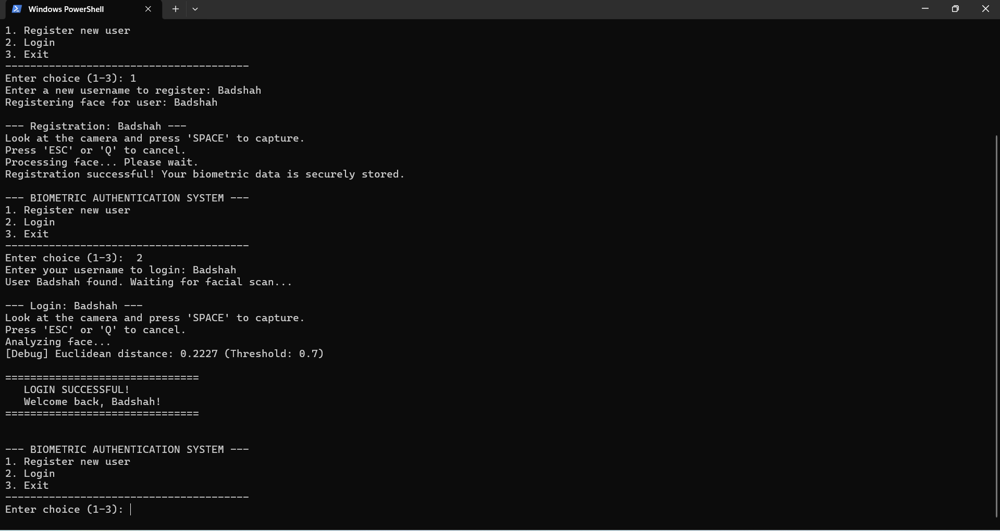
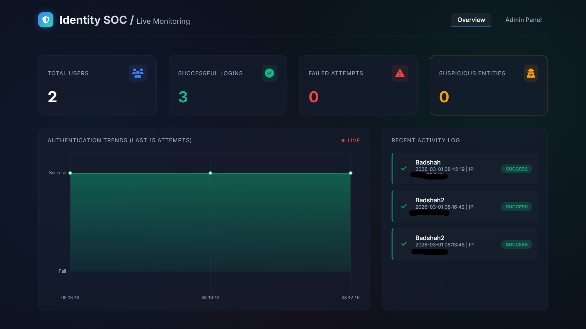
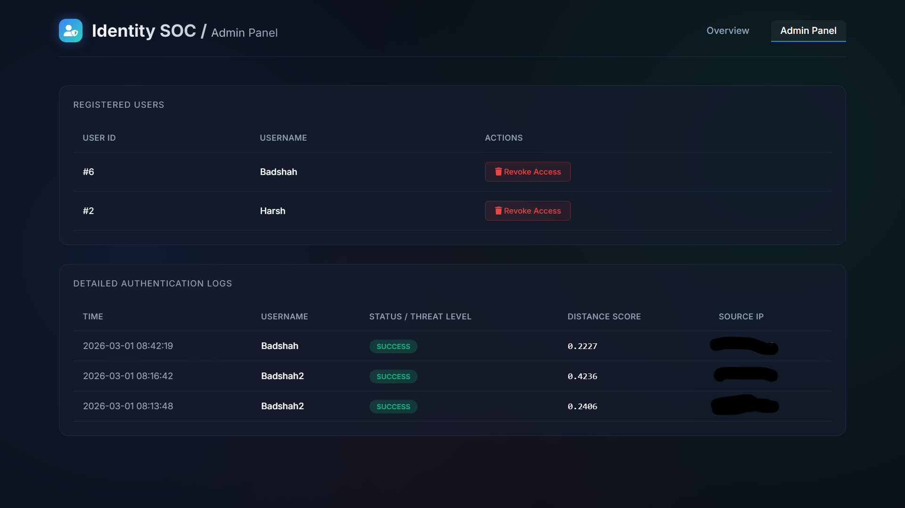

# 🔐 Identity SOC – AI Powered Biometric Authentication System

An AI-driven biometric authentication system with a real-time SOC (Security Operations Center) dashboard for monitoring login activity, detecting suspicious access, and managing users.

---

## 🚀 Features

* 👤 Face Recognition Login
* 🧠 AI-based identity verification
* 📊 Live SOC monitoring dashboard
* ⚠️ Failed login detection
* 🌐 Flask web application
* 🗄️ SQLite database logging
* 🛠️ Admin panel for user management
* 📍 IP address tracking

---

## 🧰 Tech Stack

* Python
* Flask
* OpenCV
* Deep Learning (OpenFace model)
* HTML, CSS
* SQLite

---

## 📸 Project Screenshots

### 🔐 Biometric Authentication (CLI)


### 🌐 Flask SOC Server


### 📊 SOC Dashboard – Live Monitoring


### 🛠️ Admin Panel – User Access Control


---

## 📸 System Workflow

## 📸 System Workflow

1. User registers using face biometrics
2. Face embedding stored securely
3. User logs in using face scan
4. System verifies identity
5. Event is logged in SOC dashboard

---

## ▶️ How to Run

```bash
pip install -r requirements.txt
python app.py
```

Then open:

http://127.0.0.1:5000

---

## 🔐 SOC Dashboard

* Total users
* Successful logins
* Failed attempts
* Suspicious activity detection
* Authentication logs

---

## 🎯 Use Case

This project simulates how modern organizations monitor identity-based access in a SOC environment.

---

## 👨‍💻 Author

**Badshah Khan**
Cybersecurity Enthusiast | SOC Analyst | VAPT Learner
